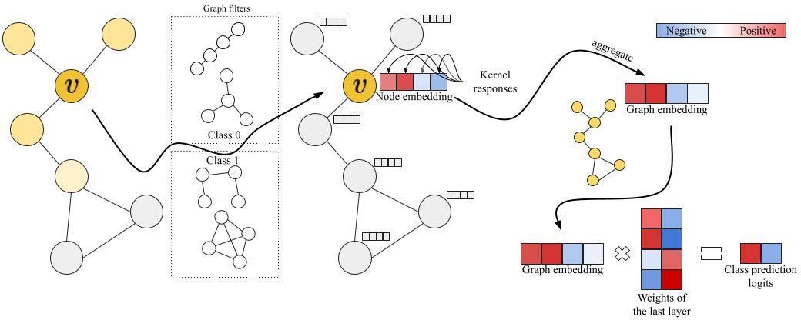

# Graph Kernel Convolutions for Interpretable Classification (GKConvIC)



## Datasets
Preprocessing datasets with labels
```
python prepare_dataset.py --dataset MUTAG --k 2 --subgraph_size 10
```
For social datasets without labels, use number of neighbours as a label
```
python prepare_dataset.py --dataset IMDB-BINARY --k 2 --subgraph_size 10 --one_in_feature
```
Our experiments use `subgraph_size=10,k=2` or `subgraph_size=15,k=3`. 

## GKConvIC
Following section provides example commands to run training.

### DiscGKConvIC
```
python train.py \
    --dataset_path datasets/saved/MUTAG/ss10_k2.pt  \
    --optimizer two_lrs  \
    --filters_sizes 6  \
    --hidden_dims 16  \
    --pool_fn add mean max \
    --contr_weight 1 \
    --fix_mlp
    --ker_activation batch_norm relu \
    --gk_layer_type non_diff \
    --kernel wl
```
### DiffGKConvIC
```
python train.py \
    --dataset_path datasets/saved/MUTAG/ss10_k2.pt \
    --optimizer scheduler \
    --filters_sizes 6 \
    --hidden_dims 16  \
    --encoder_dim 16 \
    --pool_fn add mean max \
    --contr_weight 1 \
    --fix_mlp \
    --ker_activation batch_norm relu \
    --gk_layer_type diff \
    --max_step 2 \
    --kernel rw
```
Our experiments use `filters_size` in `{6,8}`, `hidden_dims` in `{16,32}` and `max_step` in `{0,1,2}`.

## Baselines

### Graph Kernel Neural Networks (GKNN)
Model and hyperparameters are discussed in https://arxiv.org/abs/2112.07436.
```
python train.py \
    --dataset_path datasets/saved/MUTAG/ss10_k2.pt  \
    --optimizer two_lrs  \
    --filters_sizes 6 6 \
    --mlp_hidden_dims 32 \
    --hidden_dims 16 16 \
    --pool_fn mean \
    --jsd_weight 10000 \
    --ker_activation mask \
    --gk_layer_type non_diff \
    --kernel wl
```

### Kernel Graph Neural Networks (KerGNNs)
Model and hyperparameters are discussed in https://arxiv.org/abs/2201.00491.
```
python train.py \
    --dataset_path datasets/saved/MUTAG/ss10_k2.pt \
    --optimizer scheduler \
    --filters_sizes 6 6 \
    --mlp_hidden_dims 32 \
    --hidden_dims 16 16 \
    --pool_fn mean \
    --pass_x \
    --ker_activation batch_norm relu \
    --gk_layer_type diff \
    --max_step 2 \
    --kernel rw
```
